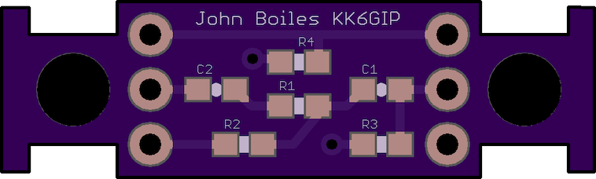
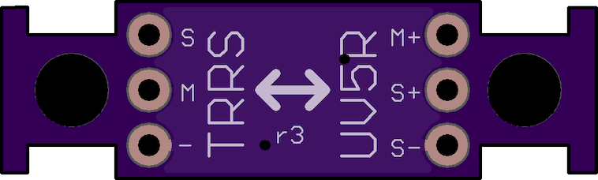
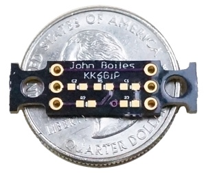
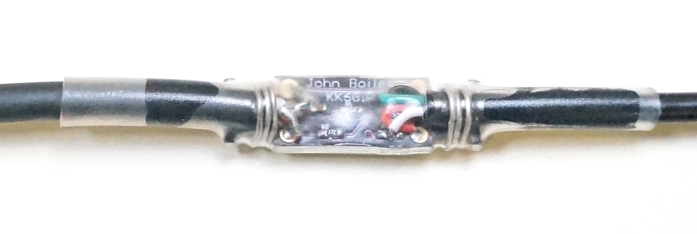
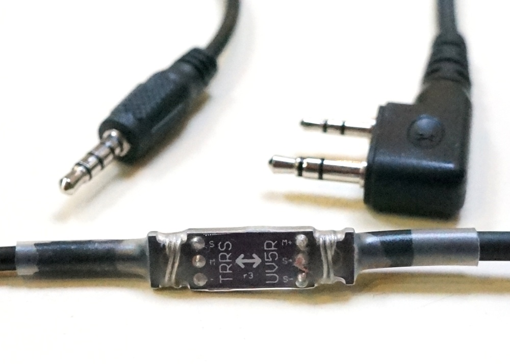
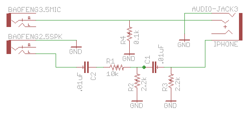

Baofeng UV5R TRRS Adapter
=========================
http://github.com/johnboiles/BaofengUV5R-TRRS

A tiny board, which allows a smartphone or similiar device to connect to the Baofeng UV5R radio via a [TRRS audio connector](https://en.wikipedia.org/wiki/Phone_connector_%28audio%29#TRRS_standards). It allows for connecting the radio to a software [TNC](https://en.wikipedia.org/wiki/Terminal_node_controller) app such as [APRSDroid](http://aprsdroid.org/) or [PocketPacket](https://itunes.apple.com/us/app/pocketpacket/id336500866?mt=8). Solder on the components, solder on the cables, then provide some stress relief, (I use solid-core wire and heat shrink tubing), and you can use your UV5R with your smartphone for APRS on the cheap.

Pictures
--------

Notes
-----
A small capacitor and 3 resistors to trick the iPhone into thinking a microphone was connected. This part of the schematic was inspired by [this article](http://www.creativedistraction.com/demos/sensor-data-to-iphone-through-the-headphone-jack-using-arduino/) on connecting Arduino to an iPhone.

A small capacitor on the speaker out of the radio removes any DC bias. (I'm not sure why this was necessary, but in my testing it made receipt of packets much more reliable.)

A 100Ω resistor is employed to improve detection on a variety of Android phones.

On my UV5R+, volume is maxed, vox is set to 2 and, squelch is set to 1. On my iPhone volume is also maxed.

Schematic
---------

Bill of Materials
-----------------
| Qty | Part                                                                                                 | Notes                                   |
|-----|------------------------------------------------------------------------------------------------------|-----------------------------------------|
| 1   | [Kenwood Type Speaker Mic Cable](https://www.argentdata.com/catalog/product_info.php?products_id=70) | You can also use 2.5mm and 3.5mm cable. |
| 1   | [3.5mm TRRS Cable](http://amzn.com/B00FJEGXLW)                                                       |                                         |
| 1   | 10kΩ Resistor 0603                                                                                   |                                         |
| 2   | 2.2kΩ Resistor 0603                                                                                  |                                         |
| 1   | 0.1kΩ Resistor 0603                                                                                  |                                         |
| 2   | 0.01uF Capacitor 0603                                                                                |                                         |
| 1   | 3" of 0.25" Diameter Heat Shrink Tubing                                                              | Optional                                |

How to Order
------------
You can order the board directly through [OSHPark](http://oshpark.com/shared_projects/qy523INb) ($1.70 for 3 boards with free shipping). Digikey or Mouser are good places to buy the resistors and capacitors.

Thanks
------

The following people have provided contributions to this design

* [kronicd VK6HAX](https://github.com/kronicd/) - optimisations to improve detection on a number of phones